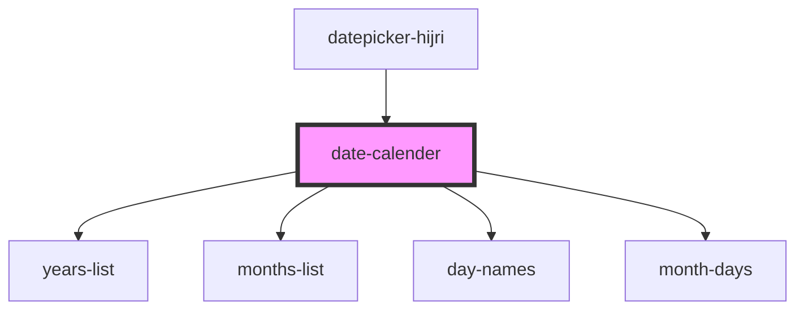

# date-calender

<!-- Auto Generated Below -->

## Properties

| Property                | Attribute                  | Description       | Type     | Default           |
| ----------------------- | -------------------------- | ----------------- | -------- | ----------------- |
| `dateFormat`            | `date-format`              |                   | `string` | `'iYYYY/iMM/iDD'` |
| `langCode`              | `lang-code`                | The language code | `string` | `'ar'`            |
| `selectedDate`          | `selected-date`            |                   | `string` | `''`              |
| `setParentSelectedDate` | `set-parent-selected-date` |                   | `any`    | `undefined`       |

## Dependencies

### Used by

 - [datepicker-hijri](../datepicker-hijri)

### Depends on

- [years-list](../years-list)
- [months-list](../months-list)
- [day-names](../day-names)
- [month-days](../month-days)

### Graph

----------------------------------------------

*Built with [StencilJS](https://stenciljs.com/)*
