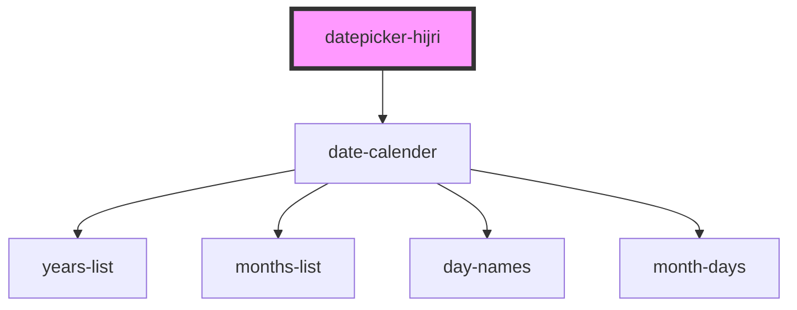

# datepicker-hijri

<!-- Auto Generated Below -->

## Properties

| Property            | Attribute              | Description | Type                                                                                                                                                                                                         | Default           |
| ------------------- | ---------------------- | ----------- | ------------------------------------------------------------------------------------------------------------------------------------------------------------------------------------------------------------ | ----------------- |
| `dateFormat`        | `date-format`          |             | `string`                                                                                                                                                                                                     | `'iYYYY/iMM/iDD'` |
| `langCode`          | `lang-code`            |             | `string`                                                                                                                                                                                                     | `'ar'`            |
| `onDateSelectClose` | `on-date-select-close` |             | `boolean`                                                                                                                                                                                                    | `false`           |
| `placement`         | `placement`            |             | `"auto" \| "auto-end" \| "auto-start" \| "bottom" \| "bottom-end" \| "bottom-start" \| "left" \| "left-end" \| "left-start" \| "right" \| "right-end" \| "right-start" \| "top" \| "top-end" \| "top-start"` | `'bottom'`        |
| `reference`         | `reference`            |             | `string`                                                                                                                                                                                                     | `undefined`       |
| `selectedDate`      | `selected-date`        |             | `string`                                                                                                                                                                                                     | `''`              |

## Dependencies

### Depends on

- [date-calender](../date-calender)

### Graph

----------------------------------------------

*Built with [StencilJS](https://stenciljs.com/)*
