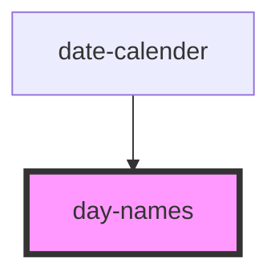

# day-names

<!-- Auto Generated Below -->

## Properties

| Property   | Attribute   | Description       | Type     | Default |
| ---------- | ----------- | ----------------- | -------- | ------- |
| `langCode` | `lang-code` | The language code | `string` | `'ar'`  |

## Dependencies

### Used by

 - [date-calender](../date-calender)

### Graph

----------------------------------------------

*Built with [StencilJS](https://stenciljs.com/)*
