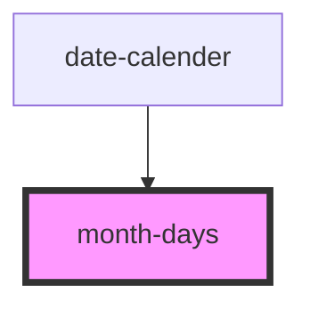

# month-days

<!-- Auto Generated Below -->

## Properties

| Property          | Attribute           | Description | Type  | Default     |
| ----------------- | ------------------- | ----------- | ----- | ----------- |
| `currentTime`     | `current-time`      |             | `any` | `undefined` |
| `dateFormat`      | `date-format`       |             | `any` | `undefined` |
| `selectedDate`    | `selected-date`     |             | `any` | `undefined` |
| `setSelectedDate` | `set-selected-date` |             | `any` | `undefined` |

## Dependencies

### Used by

 - [date-calender](../date-calender)

### Graph

----------------------------------------------

*Built with [StencilJS](https://stenciljs.com/)*
