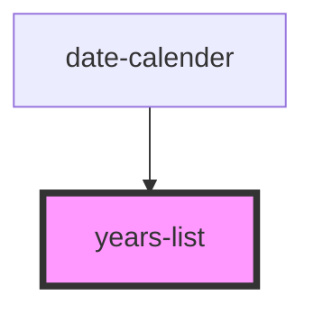

# years-list

<!-- Auto Generated Below -->

## Properties

| Property           | Attribute            | Description | Type  | Default     |
| ------------------ | -------------------- | ----------- | ----- | ----------- |
| `currentTime`      | `current-time`       |             | `any` | `undefined` |
| `handleYearChange` | `handle-year-change` |             | `any` | `undefined` |

## Dependencies

### Used by

 - [date-calender](../date-calender)

### Graph

----------------------------------------------

*Built with [StencilJS](https://stenciljs.com/)*
